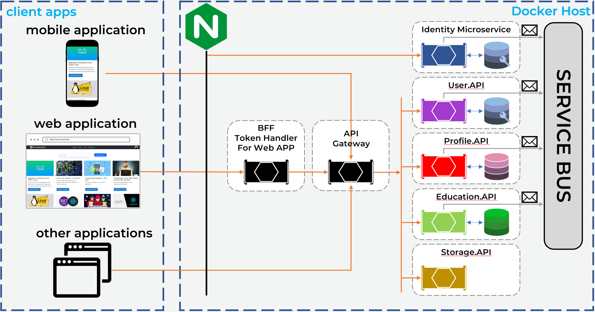
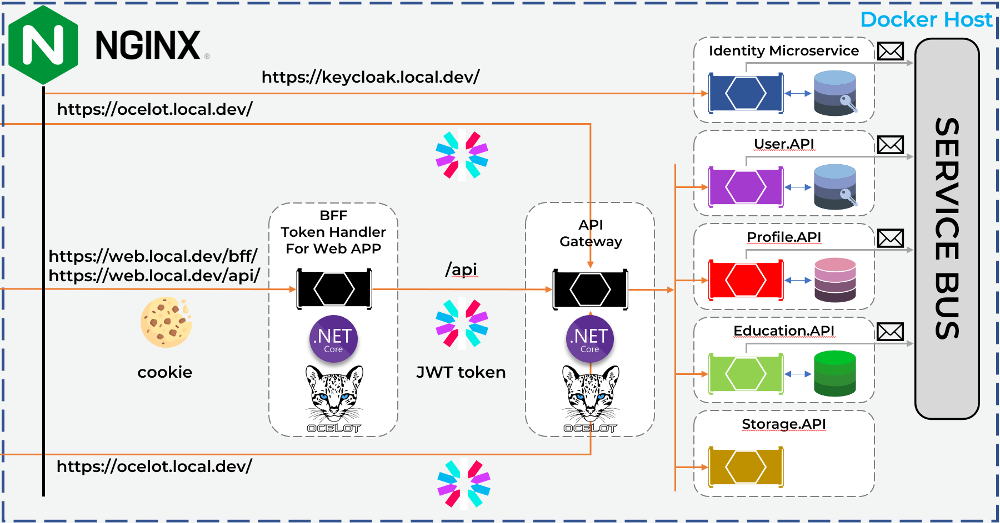

# FurtherEducation-Microservices
## Overview

  

  

## Network setup (Windows)
* Add line `127.0.0.1 web.local.dev ocelot.local.dev keycloak.local.dev` to C:\Windows\System32\drivers\etc\hosts
* Start nginx with config file provided in `nginx` folder and selfsigned certificates files (create etc folder with certificates next to config folder).
* Install self signed certificate 'RootCA.crt' in browser.

## Base commands
* Inspect services methods at http://ocelot.local.dev/swagger (look at right upper corner)
* Get bearer token by calling https://web.local.dev/bff/auth/token (you should obviously remove this method in production)

## TODO
* Service discovery (Consul)
* Migrate EduTests from Education.API to another microservice
